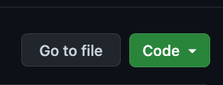

# Monday Support Panel

## Purpose

The purpose of this Chrome Extension is to put the most popular Monday.com ticket links at the fingertips of employed users. Enabling this extension will allow you to quickly click the preferred ticket option, and navigate to the new tab your ticket has appeared in, to finish filling it in. Follow the instructions below to install this extension for yourself. Being slightly faster may not have an immediate impact, though mom always says that many small changes over time can sometimes make the biggest difference.

## Installation

### Step 1

Install this folder by clicking the green "Code" button above.

Then, select Download ZIP. Direct the download to the directory of your choice. Make sure it won't be in a place where it can be easily deleted.

---

### Step 2

Open Google Chrome and click to the "Settings" icon.

Then hover over "More Tools" to reveal the "Extensions" option. Click this to proceed.

---

### Step 3

You should now see the Extensions page, along with any extensions downloaded. 

Now, focus on the top right-hand corner and you'll notice a slider for "Developer Mode".

Enter Developer Mode.

---

### Step 4

You'll now notice a new button set has appeared in the top left hand corner.

Select the option that reads "Load Unpacked". You'll be met with a prompt to select a folder to add, select "support-panel".

---

### Step 5

Feel free to test this by pinning it to your Extensions Bar, and clicking the new icon to reveal the panel. Also, feel free to message me on Slack if you have any questions, comments, or concerns regarding the tool. Thank you for downloading!

---
